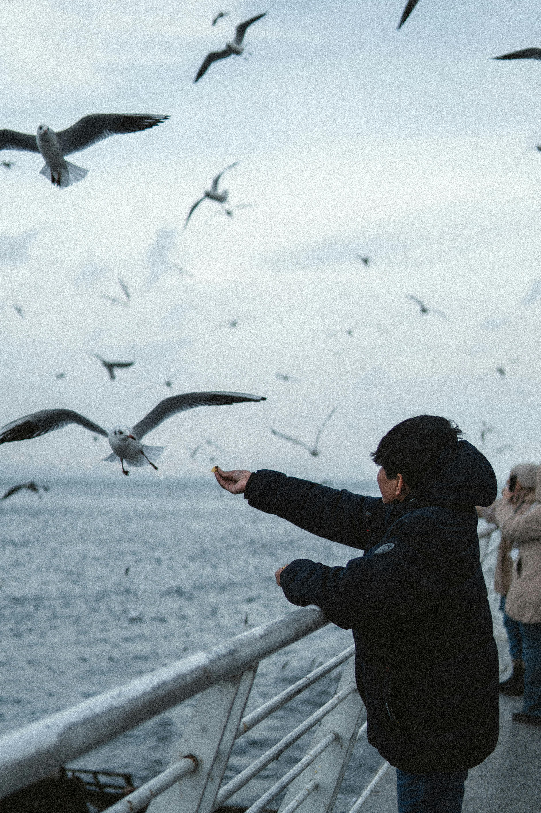

<div align="center">
  <a href="https://pixel-scout.vercel.app/">
    
  </a>
  <h2>Pixel Scout</h2>
  <p>A modern photography client management platform with interactive 3D galleries, smooth animations, and fully localized Swedish interface. Built with Next.js, TypeScript, and Tailwind CSS v4.</p>
</div>

<div align="center">
  <h2>✨ Features</h2>
</div>

- 🎨 **Interactive 3D Galleries** - OGL WebGL rendering for immersive image browsing
- 🎬 **Smooth Animations** - Framer Motion for fluid scroll and transition effects
- 🌍 **Fully Localized** - Swedish interface with responsive design
- 🎯 **Modern UI Components** - Aceternity UI with custom photography-focused designs
- 📱 **Responsive Design** - Works seamlessly on all devices
- 🚀 **Performance Optimized** - Next.js 16 with server-side rendering
<div align="center">
  <h2>🛠️ Tech Stack</h2>
</div>

- **Framework:** Next.js 16.0.7
- **Language:** TypeScript
- **Styling:** Tailwind CSS v4
- **Animations:** Framer Motion (motion/react)
- **3D Graphics:** OGL WebGL library
- **UI Components:** Aceternity UI
- **Icons:** Tabler Icons
- **Build Tools:** npm, shadcn CLI

<div align="center">
  <h2>🚀 Getting Started</h2>
</div>

```bash
# Clone the repository
git clone https://github.com/kikoDevv/pixel-scout.git

# Install dependencies
npm install

# Run the development server
npm run dev

# Open your browser
# Navigate to http://localhost:3000
```

<div align="center">
  <h2>📋 Project Structure</h2>
</div>

```
pixel-scout/
├── app/                          # Next.js App Router
│   ├── layout.tsx               # Root layout
│   ├── page.tsx                 # Landing page
│   └── globals.css              # Global styles
├── components/
│   ├── ui/                      # Reusable UI components
│   │   ├── macbook-scroll.tsx   # MacBook scroll animation
│   │   ├── lamp.tsx             # Lamp lighting effect
│   │   ├── sparkles.tsx         # Sparkle particles
│   │   ├── animated-testimonials.tsx
│   │   └── animated-list-demo.tsx
│   ├── CircularGallery.tsx      # 3D WebGL gallery
│   ├── Carousel.tsx             # Image carousel
│   ├── TrueFocus.tsx            # Hero text component
│   └── ThreeDMarquee.tsx        # 3D marquee
├── lib/
│   └── utils.ts                 # Utility functions
├── public/
│   └── splash/                  # Photography images
├── package.json
├── tsconfig.json
└── README.md
```

<div align="center">
  <h2>📸 Features in Detail</h2>
</div>

### Landing Page Sections

1. **Hero Section** - Eye-catching introduction with animated text
2. **Testimonials** - Photography testimonials from various Swedish photographers
3. **Circular Gallery** - Interactive 3D WebGL image gallery
4. **Sparkle Effects** - Animated particle effects with smooth transitions
5. **MacBook Scroll** - Beautiful scroll animation showing the platform
6. **Call-to-Action** - Swedish localized buttons for user engagement

### Component Highlights

- **AnimatedTestimonials**: Carousel with smooth rotation and fade effects
- **CircularGallery**: 3D WebGL rendering using OGL library
- **MacbookScroll**: Scroll-triggered animations with perspective transforms
- **SparklesCore**: Particle system with customizable density and colors
- **TrueFocus**: Hero text with video effects

<div align="center">
  <h2>🌐 Localization</h2>
</div>

- **Swedish (sv)** - Complete UI localization
- Photographer testimonials and role-specific content
- All buttons and CTAs in Swedish

---

<div align="center">
  Made with ❤️ by <a href="https://github.com/kikoDevv">KikoDevv</a>
</div>

<div align="center">
  📧 Contact: <a href="mailto:Kiko.devv@gmail.com">Kiko.devv@gmail.com</a>
</div>

<div align="center">
  ⭐ If you find this project useful, please consider giving it a star!
</div>
